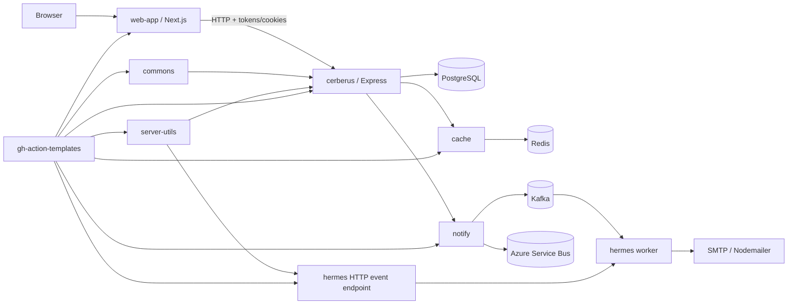

# Apart System and Quality Baseline

**Assessment date:** 2026-08-29  
**Scope:** `web-app`, `cerberus`, `hermes`, `cache`, `notify`, `commons`, `server-utils`, and `gh-action-templates`  
**Purpose:** Establish the evidence baseline for a test-first refactoring program. This document records current behavior and risk; it does not approve architectural changes.

## Executive assessment

The workspace is an independently versioned, event-assisted TypeScript system. `web-app` calls the Cerberus authentication/account API. Cerberus persists account, profile, organization, role, session, and invitation data in PostgreSQL, uses Redis through `cache`, and emits account-domain events through `notify`. Hermes consumes those events and sends transactional email. Shared runtime behavior is published through `commons` and `server-utils`; CI/CD is centralized through reusable workflows in `gh-action-templates`.

The current system is not refactor-safe. Across 456 TypeScript/TSX files and approximately 20,617 source lines, only two test files exist. Five repositories accept a zero-test run, Hermes has a placeholder test command, and the web app has no test script. No repository enforces coverage. The reusable CI checks only installation, type checking, linting, and a test command; it does not check formatting, builds, coverage, contracts, integration behavior, end-to-end behavior, dependency risk, source scanning, container behavior, or migration safety.

## System topology

## Repository inventory

| Repository | Responsibility | TS/TSX files | Approx. lines | Test files | Current test behavior |
|---|---|---:|---:|---:|---|
| `web-app` | Next.js UI, auth/profile state, API clients, forms, marketing and settings views | 216 | 14,262 | 0 | No `test` script; `npm test --if-present` exits successfully without testing |
| `cerberus` | Auth/account API, RBAC, organizations, profiles, sessions, PostgreSQL migrations | 172 | 3,486 | 0 | Jest uses `--passWithNoTests`; dependency installation is blocked without private registry auth |
| `hermes` | Event workers, HTTP event ingress, email delivery | 21 | 761 | 0 | Placeholder test command exits successfully; dependency installation is blocked without private registry auth |
| `cache` | Redis client and repository-cache behavior | 6 | 349 | 0 | Vitest uses `--passWithNoTests`; coverage command is missing its provider |
| `notify` | Kafka, Azure Service Bus, and synchronous service notification adapters | 18 | 1,007 | 0 | Vitest uses `--passWithNoTests`; dependency installation is blocked without private registry auth |
| `commons` | Encryption, JWT, promises, shared errors, Objection base model | 15 | 375 | 0 | Vitest uses `--passWithNoTests`; coverage command is missing its provider |
| `server-utils` | Express app factory and logging factory | 8 | 377 | 2 | 9 pass, 1 skipped, but an unhandled listener error fails the run; coverage is below target |
| `gh-action-templates` | Reusable CI, package release, Docker release, setup and status actions | YAML | n/a | 0 | No workflow lint, security analysis, fixture repository, or reusable-workflow test harness |

## Runtime and infrastructure inventory

### Web application

- Next.js 14 App Router, React 18, TypeScript strict mode, React Query, Redux Toolkit with persisted browser state, React Hook Form, Zod, Tailwind, Radix UI, Google Maps, and Vercel Blob.
- 31 application routes are emitted by the current production build.
- The `/settings/personal-info` route emits approximately 2.64 MB first-load JavaScript and needs a performance budget gate.
- Authentication state is split among API responses, browser local storage, Redux persistence, and server cookies. This is a critical contract boundary.

### Cerberus

- Express service with Objection/Knex and 15 timestamped PostgreSQL migrations.
- Public authentication/account routes, authenticated profile/role/session/organization routes, and API-key-protected migration administration routes.
- Critical behavior includes password hashing, JWT access/refresh flow, session creation, OTP verification/recovery, RBAC, invitation acceptance, transactional writes, cache invalidation, and event publication.
- The current Compose file uses PostgreSQL 9.6. Production compatibility must be established before the database image is changed.

### Messaging and notifications

- `notify` abstracts Kafka, Azure Service Bus, and synchronous HTTP delivery.
- Hermes can receive events through a worker and an HTTP event route, dispatch domain handlers, and deliver email through Nodemailer.
- No versioned event schema, compatibility check, dead-letter behavior test, idempotency proof, retry policy test, or provider contract suite exists.

### Shared libraries

- `commons` owns security-sensitive primitives such as hashing and JWT verification.
- `cache` owns Redis connection, timeout, retry, key mapping, hit/miss, and fallback behavior.
- `server-utils` owns process-wide HTTP middleware initialization, server startup, logging, and shutdown-adjacent behavior.
- These libraries have broad blast radius and require contract tests in addition to unit coverage.

### Delivery system

- Product repositories call reusable workflows from `otedesco/gh-action-templates@main`, a mutable branch reference.
- Third-party actions are referenced by moving tags instead of reviewed full commit SHAs.
- Workflow permissions are not explicitly minimized, and product workflows use `secrets: inherit`.
- The shared setup action now accepts `npm-token` and `registry-auth-required`, validates credentials before private installs, and never rewrites `.npmrc`; consumer workflows pass only named `NPM_TOKEN`/`GH_TOKEN` secrets.
- Node 18.17.x is pinned in CI and Dockerfiles. Node 18 reached end of life on 2025-03-27; the supported target must be selected and tested before migration.
- Live GitHub inspection returned zero repository rulesets and zero visible workflow runs for all eight repositories. Branch-protection details could not be read because the connected integration lacks that permission, so protection must be verified by an administrator before the enforcement milestone closes.
- The M1 workflow fixture contract now includes a valid control, six executable single-defect foundation fixtures, and static fail-closed security/container fixtures. Reproduction details are in `docs/testing/workflow-fixtures.md`.

## Executable baseline

| Check | Result |
|---|---|
| Clean checkout state | All eight repositories were clean before documentation changes |
| `web-app` type check | Pass |
| `web-app` production build | Pass with warnings; 31 routes generated |
| `web-app` lint with zero-warning policy | Fail: 53 warnings in 29 files |
| `web-app` dependency audit | 26 findings: 5 moderate, 19 high, 2 critical |
| `cache` type/lint/format/build | Pass, but lint reports 8 warnings |
| `cache` tests | Green with zero tests because `--passWithNoTests` is enabled |
| `cache` coverage | Fail: `@vitest/coverage-v8` is absent |
| `commons` type/lint/format/build | Pass, but lint reports 19 warnings |
| `commons` tests | Green with zero tests because `--passWithNoTests` is enabled |
| `commons` coverage | Fail: `@vitest/coverage-v8` is absent |
| `server-utils` type/lint/build | Type/build pass; lint reports 2 warnings; formatting fails in 4 files |
| `server-utils` tests | 9 pass, 1 skipped, then run fails on an unhandled `listen EPERM` error |
| `server-utils` coverage | Statements 95.26%, branches 87.5%, functions 90.9%, lines 95.26%; command fails due to unhandled error |
| `notify`, `cerberus`, `hermes` install | Missing credentials fail in the shared preflight with an actionable `NPM_TOKEN` error before package resolution; authenticated clean-install evidence remains dependent on CI/OPS-177 credentials |

## OPS-177 registry-auth evidence

- `pnpm test:registry-auth` passes with 100% statement, branch, function, and line coverage for `registry-auth.mjs`.
- The missing-token CLI path returns non-zero and emits only the actionable GitHub error annotation; the valid-token path reports configuration without printing the token.
- The three consumer `.npmrc` files remain credential-free `${NPM_TOKEN}` placeholders, and all relevant caller workflows use explicit named secrets instead of `secrets: inherit`.
- Docker installers require the `npm_token` BuildKit secret and use `pnpm install --frozen-lockfile`; no token build argument or token-bearing `.npmrc` rewrite remains.

## OPS-178 quality-script evidence

- The central quality-script contract covers all seven repositories and passes structural validation.
- `format:check`, `lint:check`, `type:check`, `test`, `test:coverage`, `build`, and `quality:check` are now declared everywhere; the reusable workflow invokes the six checks separately and supports the approved npm exception.
- Check-only commands contain no fix/write flags, forced exits, pass-with-no-tests options, ignored failures, or placeholder success paths.
- Hermes and web-app test/coverage commands fail explicitly on missing `OPS-217` and `OPS-228` harnesses. The six repositories with existing test commands now fail honestly on zero tests or missing coverage providers where applicable.

## OPS-180 truthful core-gate evidence

- Six stable gates (`format`, `lint`, `type`, `unit`, `coverage`, `build`) map to canonical check-only scripts.
- The reusable workflow runs named fail-closed steps and checks tracked-file drift after build.
- Sixteen deterministic fixtures passed three consecutive repetitions without mutation or timeout.
- Vitest consumers declare V8 coverage providers; Cerberus collects all source and emits complete reports. Hermes and web-app retain explicit OPS-217/OPS-228 blockers.
- Local verification used available Node 20.11.1 / 25.6.0 rather than Node 24.20.0; `actionlint` was unavailable locally.

## High-risk characterization targets

These are observations that tests must characterize before refactoring; they are not silently approved fixes.

1. Authentication naming varies between `accessToken`, `access_token`, `accessTtoken`, and response shapes with both camelCase and snake_case expectations.
2. Web authentication persists access and refresh tokens in local storage while the server also sets cookies; the intended threat model and source of truth are undocumented.
3. Sign-out clears cookies but has a TODO for server-side session invalidation.
4. Session last-activity update is fire-and-forget in a read path.
5. Account OTP verification includes a testing OTP bypass in runtime code.
6. Cerberus logs deserialized token payload data and several web actions log account/profile payloads.
7. RBAC middleware stores `organizaionId` with a misspelled key, making downstream behavior fragile.
8. Invitation acceptance explicitly leaves invitation status updates as a TODO.
9. Notification publication remains synchronous in multiple critical transaction paths because async delivery is marked unfinished.
10. The cache package contains permissive `any`-typed boundaries and timeout/retry behavior without tests.
11. Provider consumers log malformed events but have no proved poison-message, retry, or dead-letter strategy.
12. The existing `server-utils` test opens a real listener and reports passing assertions before an unhandled process error.

## Risk classification

### Critical

- Authentication, token/cookie handling, password hashing, OTP, recovery, session lifecycle, and authorization.
- Organization membership, invitations, role assignment, and tenant/user data isolation.
- Database migrations, transactions, constraints, rollback, and cache consistency.
- Event serialization, producer acknowledgment, consumer idempotency, retry/dead-letter handling, and email side effects.
- Secrets, dependency provenance, CI permissions, release workflows, Docker images, and deploy artifacts.
- End-to-end sign-up, verification, sign-in, role/profile selection, account update, sign-out, and recovery journeys.

### Non-critical but still in the 100% executable-code policy

- Presentational components, marketing routes, configuration mapping, utilities, selectors, pagination, responsive branches, empty/loading/error states, email template rendering, and logger formatting.
- Non-executable type declarations, generated build output, vendored code, and test fixtures are not coverage subjects, but they remain subject to type, schema, snapshot, or generation-drift checks as appropriate.

## Refactoring entry criteria

Large-scale refactoring must not begin until all of the following are true:

1. Every repository installs reproducibly from a clean checkout with documented credentials and a frozen lockfile.
2. Required CI checks exist, are deterministic, and are enforced on `main` through a ruleset or branch protection.
3. Changed executable code is held to 100% statements, branches, functions, and lines.
4. Global coverage is ratcheted upward and cannot decrease; the final refactoring milestone requires 100% across all four metrics.
5. Critical API, event, database, and browser journeys have integration/contract/end-to-end coverage, not only mocked unit tests.
6. Mutation testing demonstrates that assertions detect meaningful behavioral changes.
7. No critical/high dependency or container vulnerability is unreviewed; exceptions are time-bounded and owned.
8. Flaky tests are quarantined only through a documented, expiring exception; required checks never use retries to hide nondeterminism.
9. The architecture decision record for authentication state, event contracts, and database target is accepted.

## Authoritative external references

- [Node.js release status](https://nodejs.org/en/about/previous-releases)
- [GitHub Actions security hardening](https://docs.github.com/en/code-security/tutorials/secure-your-organization/protect-against-threats)
- [GitHub Actions repository policies](https://docs.github.com/en/repositories/managing-your-repositorys-settings-and-features/enabling-features-for-your-repository/managing-github-actions-settings-for-a-repository)
